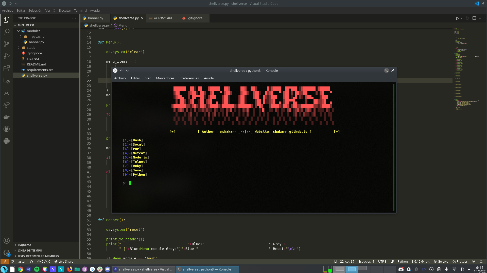

<h1 align="center">Shellverse</h1>

    
    

# Description

Shellverse is a simple tool made in python with which you can get fast access to a different variety of reverse shell codes to copy to the clipboard, like python, bash, node, among many other.

# Future implementations

